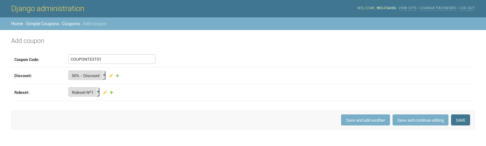
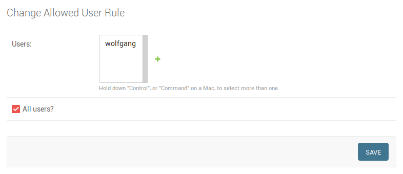
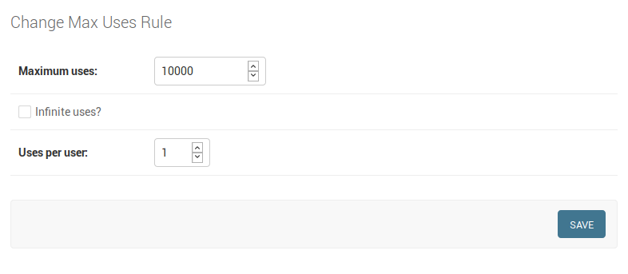
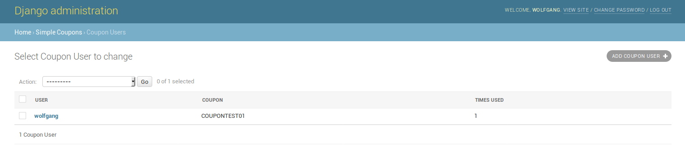

# django-simple-coupons
##  A Django app that makes the use of coupons a simple task!


django-simple-coupons is a simple Django app to create and use promotional coupons in your website.

Creating the coupons is a simple task, but first, follow the instructions to install the app in your project:

### Installing:

1 - Add ```django_simple_coupons``` inside INSTALLED_APPS in settings.py:

```python
INSTALLED_APPS = [
        ...
        'django_simple_coupons',
]
```

2 - (Optional) If you want to use more than 12 chars (default) for your coupon code, add ```DSC_COUPON_CODE_LENGTH``` variable in settings.py:

```python
DSC_COUPON_CODE_LENGTH = 16
```

3 - (Optional) If you make use of another User model in your project, add ```DSC_USER_MODEL``` variable in settings.py:

```python
DSC_USER_MODEL = 'custom_auth.models.User'  # app.module.class format (example)
```

4 - Run the migrations:

```bash
$ python manage.py makemigrations
$ python manage.py migrate
```

And that's it! django-simple-coupons should appear in your admin as ```Simple Coupons```.

### Coupons:

Each coupon has a ***code***, ***discount*** and set of rules (known as ***ruleset*** in the admin).

Every time you click ```Add Coupon```, a new coupon code will be generated randomly for you. Don't worry, you can set your own personal code if you wish.



Each ruleset has three basic rules that you need to supply: ***Allowed user rule***, ***Max uses rule*** and ***Validity rule***.

### Ruleset:

Every coupon needs a set of rules to make it valid and useable.
For now, django-simple-coupons use three basic rules:

##### Allowed user rule:

Defines which users are allowed to use the coupon.



##### Max uses rule:

Defines how many uses the coupon should have in general and for each user.



##### Validity rule:

Defines the expiration date for the coupon and if it's active or not.


### Coupon User:

Every time a user uses a coupon, he will be added to a list called ```Coupon Users``` in admin.




### Usage Example:

```python
# views.py - Example only
# /use-coupon/?coupon_code=COUPONTEST01

from django.contrib.auth.models import User
from django.http import HttpResponse

from django_simple_coupons.validations import validate_coupon
from django_simple_coupons.models import Coupon

class UseCouponView(View):
    def get(self, request, *args, **kwargs):
        coupon_code = request.GET.get("coupon_code")
        user = User.objects.get(username=request.user.username)
        
        status = validate_coupon(coupon_code=coupon_code, user=user)
        if status['valid']:
            coupon = Coupon.objects.get(code=coupon_code)
            coupon.use_coupon(user=user)
        
            return HttpResponse("OK")
        
        return HttpResponse(status['message'])
```

To use django-simple-coupons accordingly, you'll need to validate the coupon first with the coupon code and the user that will use the coupon.

To validate the coupon, use the method ```validate_coupon()``` from ```django_simple_coupons.validators```. This method returns a dict with one key (if valid) or two keys (if not valid):

```python
VALID = {
    "valid": True
}

INVALID = {
    "valid": False,
    "message": "Some message telling why it's not valid"
}
```

If it's valid, you can safely call the function ```use_coupon()``` from the Coupon instance.

Please note that I used the default User model from Django in this example. If you use a custom authentication system, you'll need to use the proper User model from your custom auth app!
